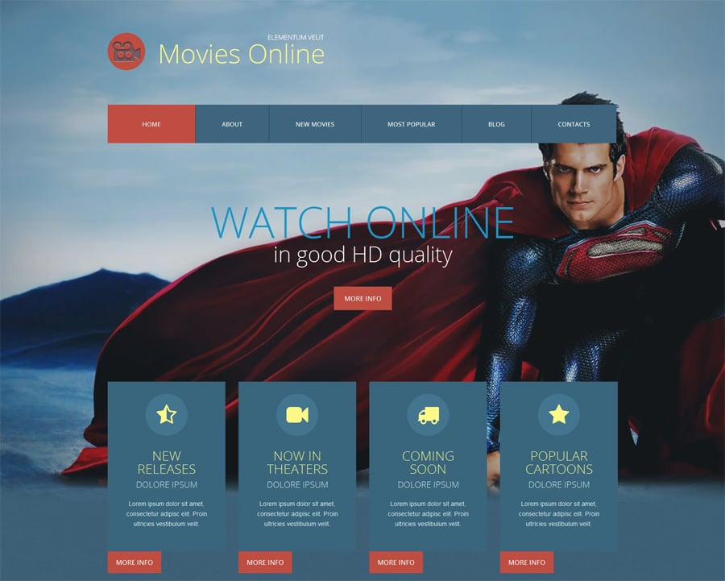

#🚀 Landing Page Project

Image:

Introduction
This landing page project was inspired by a photo I found on a social network. I decided to recreate it, and today, I’m sharing the result. The project allowed me to revisit tools I hadn’t used in a while, as I continue working on other projects.

###Installation
Clone this repository: git clone https://github.com/WayneJOLY/Movies-Landingpage.git
Navigate to the project folder: cd landing-page
Install dependencies: npm install
Usage
To view the landing page, open index.html in your browser.

##Technologies Used
- **Frontend**: 
  - 
  
  - 
  
  - 

##📞  Contact
Feel free to reach out if you’d like to collaborate or learn more about the tools I used. You can find me on LinkedIn 
# 🌐 Socials:
 
